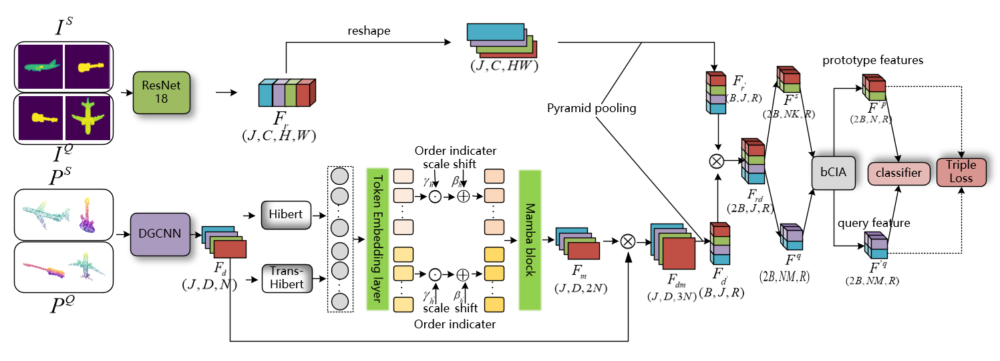

# Fusing Mamba and DGCNN for Robust Few-Shot 3D Point Cloud Classification




## Introduction

Few-shot classification for 3D point clouds remains a challenging task, primarily because real-world data is often noisy and incomplete, complicating robust feature learning from limited samples. Real-world point clouds are inherently irregular and often contain missing points and noise, posing difficulties for robust classification from scarce data. 

To address these challenges, we propose a novel framework that fuses Mamba and DGCNN for robust few-shot 3D point cloud classification. To overcome challenges from data sparsity and noise in few-shot scenarios, our model creates a holistic object representation. It moves beyond purely local feature extraction by fusing the detailed geometric information from a DGCNN with the global, long-range context provided efficiently by a Mamba architecture. This fusion of local and global features enhances the model's resilience to partial artifacts and sensor noise. 

Furthermore, we introduce a multi-bin Cross-Instance Adaptation (bCIA) module to more comprehensively model the correlations between support and query sets, mitigating the problem of large intra-class variance and small inter-class variance that arises from data scarcity. Rigorous evaluation across ModelNet40, ModelNet40-C, and ScanObjectNN benchmarks validates the efficacy of our approach. The proposed framework consistently surpasses established baselines, achieving a 1.46% improvement on the ScanObjectNN dataset in the 5-way 5-shot setting.

## Architecture Overview

Our proposed DGCNN-Mamba framework integrates local geometric feature extraction with global contextual modeling for robust few-shot 3D point cloud classification. The architecture consists of three main components:

### 1. **Point Cloud Feature Extraction (DGCNN Branch)**
- **Input Processing:** Raw 3D point clouds (B×N×3) are processed through DGCNN backbone
- **Local Feature Learning:** K-NN graph construction with dynamic graph CNN layers
- **Geometric Representation:** Extracts local geometric patterns and spatial relationships
- **Output:** Local geometric features with dimensions (B×D×N)

### 2. **Global Context Modeling (Mamba Branch)**
- **Hilbert & Trans-Hilbert Processing:** Dual-path feature transformation for enhanced representation
- **Token Embedding:** Converts point features to sequence tokens with positional encoding
- **Mamba Blocks:** State Space Model (SSM) layers capture long-range dependencies efficiently
- **Global Context:** Generates global contextual features (B×D×2N)

### 3. **Cross-Modal Feature Fusion (bCIA Module)**
- **Multi-Bin Processing:** Features are processed through multiple bin sizes [1, 2, 4, 8, 16, 32] for comprehensive representation
- **Cross-Instance Adaptation:** Bidirectional attention mechanism between support and query sets
- **Support-Query Fusion:** 
  - Support features enhanced with query context: `S_cross = S + MLP([S, Attn(S→Q)])`
  - Query features enhanced with support context: `Q_cross = Q + MLP([Q, Attn(Q→S)])`
- **Feature Integration:** Combines local DGCNN features with global Mamba context through element-wise multiplication

### 4. **Few-Shot Classification Head**
- **Prototype Learning:** Support features serve as class prototypes
- **Distance Computation:** Cosine similarity between query and prototype features
- **Triple Loss:** Metric learning optimization for better feature discrimination
- **Classification:** Softmax-based prediction with enhanced feature representation

### Key Innovations:
- **Efficient Long-Range Modeling:** Mamba SSM provides O(L) complexity vs O(L²) for transformers
- **Multi-Scale Feature Fusion:** Multiple bin sizes capture different levels of feature granularity
- **Robust Feature Learning:** Combination of local geometric and global contextual information
- **Cross-Instance Enhancement:** Bidirectional attention improves support-query correlation modeling

## Installation

This project is built upon the following environment:
* Install Python 3.6+
* Install CUDA 11.0+
* Install PyTorch 1.10.2+

### Basic Requirements
```bash
pip install pytorch==1.10.2
pip install tqdm==4.63.1
pip install tensorboard==2.8.0
```

### Extension Dependencies

#### Chamfer Distance & EMD
```bash
cd ./extensions/chamfer_dist && python setup.py install --user
cd ./extensions/emd && python setup.py install --user
```

#### PointNet++
```bash
pip install "git+https://github.com/erikwijmans/Pointnet2_PyTorch.git#egg=pointnet2_ops&subdirectory=pointnet2_ops_lib"
```

#### GPU kNN
```bash
pip install --upgrade https://github.com/unlimblue/KNN_CUDA/releases/download/0.2/KNN_CUDA-0.2-py3-none-any.whl
```

#### Mamba Dependencies
```bash
pip install causal-conv1d>=1.2.0
cd mamba && pip install .
```

## Datasets

* Download [ModelNet40](https://modelnet.cs.princeton.edu/)
* Download [ModelNet40-C from Google Drive](https://drive.google.com/drive/folders/10YeQRh92r_WdL-Dnog2zQfFr03UW4qXX)
* Download [ScanObjectNN](https://hkust-vgd.github.io/scanobjectnn/)

All data used in this project is in .npy format.

## Training

Train a model on the ModelNet40 dataset by:
```bash
python main.py --dataset modelnet40 --fs_head crossAtt_mixmodel
```

## Evaluation

```bash
python main.py --train False
```

## Results

Our framework achieves significant improvements over baseline methods:
- **ModelNet40:** Consistent performance improvement in few-shot scenarios
- **ModelNet40-C:** Robust classification under corruption and noise
- **ScanObjectNN:** **1.46% improvement** in 5-way 5-shot setting

## Citation

If you find this work useful, please cite our paper:

```bibtex
@article{dgcnn-mamba-2024,
  title={DGCNN-Mamba: Robust Few-Shot 3D Point Cloud Classification via Cross-Modal Feature Fusion},
  author={Your Name},
  journal={arXiv preprint},
  year={2024}
}
```

## License

This project is licensed under the MIT License - see the LICENSE file for details.
